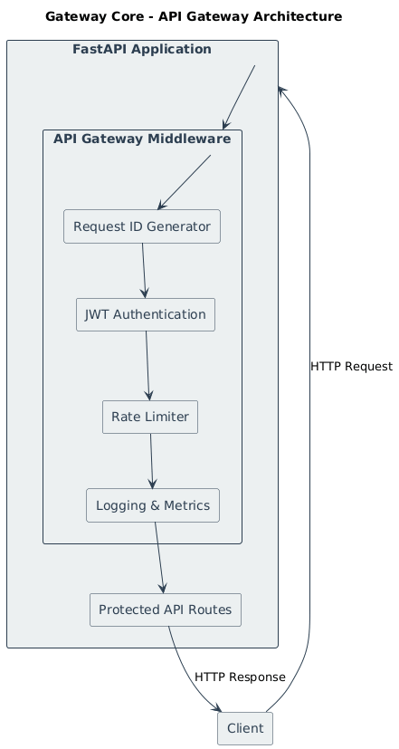

# Gateway Core 🚪

**Gateway Core** is a production-style API Gateway built using **FastAPI** to demonstrate how
modern backend systems handle **authentication, rate limiting, observability, and traffic control**
at a centralized entry point.

The project is designed around **middleware-driven architecture**, mirroring real-world backend
systems where cross-cutting concerns are enforced before requests reach application logic.

---

## 🚀 Key Features

- Global request interception using FastAPI middleware  
- JWT-based authentication enforced at the gateway level  
- Per-user rate limiting to prevent abuse  
- Structured JSON logging with request tracing (Request IDs)  
- In-memory metrics collection for traffic and error monitoring  
- Lightweight, read-only metrics dashboard for real-time visibility  

---

## 🧠 Architecture Overview

All incoming requests pass through a centralized middleware layer that enforces
authentication, rate limiting, logging, and metrics before reaching protected routes.

## 🖥 Dashboard Preview

